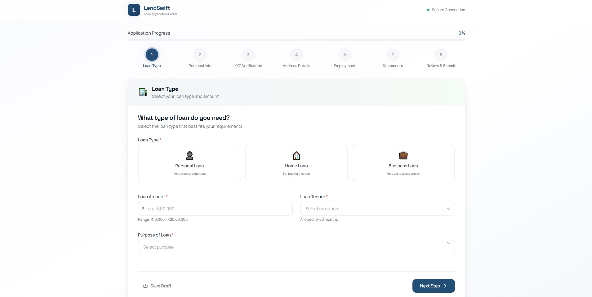

# Loan Application Wizard

- **Live Demo:** [https://loan-application-wheat.vercel.app](https://loan-application-wheat.vercel.app)
- **Repository:** [https://github.com/GziXnine/loan-application](https://github.com/GziXnine/loan-application)

A comprehensive, multi-step loan application form built with React, Vite, React Hook Form, Zod, and Zustand.

## Project Description

This project implements a robust Loan Application Wizard, guiding users through an 8-step application process. It features local auto-save capabilities, cross-step validation, document uploading, and a signature pad for final submission.

## Architecture Decisions

### Why Wizard Pattern?
A multi-step (wizard) approach breaks down a complex and lengthy loan application into manageable, focused chunks. This significantly improves the User Experience (UX), reduces cognitive load, and allows us to validate smaller sections of data at a time. It also isolates state, meaning a failure in one step doesn't corrupt the entire form.

### Why React Hook Form (RHF) over Formik?
- **Performance:** RHF leverages uncontrolled components and isolates re-renders to only the fields being interacted with. Formik relies heavily on React state, causing whole-form re-renders on every keystroke.
- **API & Wizard Integration:** RHF's `useFormContext` and default values structure make it incredibly easy to manage form state across multiple wizard steps.

### Why Zod over Yup?
- **Developer Experience:** Zod provides superior TypeScript-like type inference and a more modern, chained API.
- **Bundle Size & Performance:** Zod is generally lighter and faster than Yup.
- **Integration:** Zod pairs perfectly with React Hook Form via `@hookform/resolvers`, making dynamic schema validation (based on previous step answers) seamless.

## Setup Instructions

1. Clone the repository.
2. Ensure you have Node.js installed (v18+ recommended).
3. Install dependencies:
   ```bash
   npm install
   ```
4. Start the development server:
   ```bash
   npm run dev
   ```

## Test Running Instructions

The project uses Vitest for unit testing and Cypress for End-to-End (E2E) testing.

- **Run Unit Tests:**
  ```bash
  npm run test:unit
  ```
- **Run E2E Tests (Headless):**
  ```bash
  npm run test:e2e
  ```
- **Open Cypress UI:**
  ```bash
  npm run cypress:open
  ```

## Screenshots



## Known Limitations

- **Local Storage Auto-Save:** The auto-save functionality relies on the browser's `localStorage`. This means data will not persist across different browsers, devices, or if the user clears their browser cache.
- **Backend Integration:** This is a frontend-only implementation. The final submission is mocked and logged, rather than being sent to a real REST API or database.
- **File Upload Storage:** Uploaded document files are stored temporarily in browser memory/state. A production app would require a secure blob storage service (like AWS S3) with pre-signed URLs.
